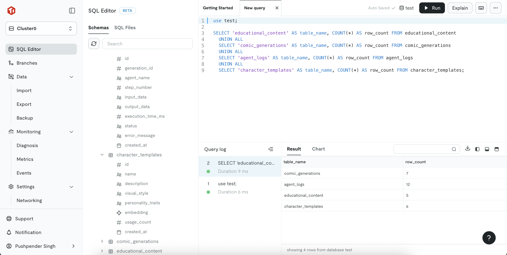

<h1 align="center">EduMate</h1>
<p align="center">
    <a href="https://python.org">
    
  </a>
  <a href="https://deepmind.google/">
    
  </a>
  <a href="https://flask.palletsprojects.com/">
    
  </a>
  <a href="https://www.pingcap.com/tidb/">
    
  </a>
  <a href="https://cloud.google.com/">
    
  </a>
  <a href="https://huggingface.co/">
    
  </a>
  <a href="https://github.com/pushpenderindia/EduMate">
    
  </a>
</p>

<p align="center">
  <strong>🏆 TiDB AgentX Hackathon 2025 Submission</strong><br>
  EduMate is a Multi-Step Agentic AI Platform built with TiDB Serverless that transforms educational content into engaging visual comics through intelligent agent workflows and vector search capabilities.
</p>

## 🤖 Multi-Step Agentic Workflow - Hackathon Requirements Met

EduMate implements a sophisticated **multi-step agentic AI solution** that chains together multiple building blocks as required by the TiDB AgentX Hackathon:</p>

### 🎯 Agentic Workflow Architecture

**Step 1: Ingest & Index Data**
- Educational content, curriculum standards, and comic templates are ingested into TiDB Serverless
- Vector embeddings are generated and stored using TiDB's vector search capabilities
- Full-text indexing of educational materials for content retrieval

**Step 2: Search Your Data** 
- Agent queries TiDB vector indexes to find relevant educational content and similar comic styles
- Full-text search retrieves curriculum-aligned materials and character templates
- Hybrid search combines vector and traditional search for optimal content matching

**Step 3: Chain LLM Calls (Multi-Agent System)**
- **Content Planning Agent**: Analyzes educational requirements using Gemini 2.0 Flash
- **Dialogue Generation Agent**: Creates age-appropriate comic conversations
- **Visual Prompt Agent**: Generates detailed scene descriptions for image generation
- **Quality Assurance Agent**: Reviews content for educational standards compliance

**Step 4: Invoke External Tools**
- Google Imagen (nano banana) API integration for high-quality visual content generation
- OpenCV processing for text overlay and comic formatting
- PDF generation services for downloadable content
- Google OAuth for authentication

**Step 5: Multi-Step Automated Flow**
- Complete automated pipeline from educational topic input to finished comic delivery
- Real-time progress tracking via TiDB Serverless database
- Intelligent caching and retrieval optimization

# Project Demonstration

- Click on this below image for playing video

[](https://youtu.be/DWEAnfSkJKM)

## Educational Challenge
- Modern students struggle with `declining attention spans` that impact learning effectiveness:
    - Average goldfish attention span: `9 seconds`
    - Current human attention span: `8 seconds`

- Educational institutions face significant challenges in addressing `sensitive or complex topics` that are often avoided in traditional curricula, including `health education`, `social awareness`, `mental health`, and other important life skills.

- Research from the `National Center for Biotechnology Information (NCBI)` indicates that approximately `65%` of learners are `visual processors`. Traditional text-heavy educational approaches result in:
    - Reduced comprehension rates
    - Poor information retention
    - Decreased student engagement
    - Limited creative thinking development
    - Increased cognitive burden
    - Difficulty in practical application

## Our Educational Solution
- EduMate is an innovative learning platform that `transforms conventional educational content and challenging topics` into visually engaging `comic and manga formats`.

- Educators and students can `customize storylines` and `character development` or simply `input educational topics` to generate interactive content in their preferred `visual style` including `superhero comics`, `graphic novels`, `anime`, and more.

- Our platform integrates Google's Gemini 2.0 Flash for advanced text processing and educational content generation, combined with `Google Imagen (nano banana)` for `high-quality text-to-image conversion`.

- We've engineered our system to `generate complete educational comics within 30-50 seconds` through `multi-agent coordination`, `TiDB Serverless caching`, and `intelligent workflow orchestration`.

## Platform Features
- [X] Generate content in multiple visual styles (superhero, manga, graphic novel, etc.)
- [X] Customize characters and educational storylines
- [X] Generate shareable comic links and downloadable PDF formats
- [X] Immersive reading experience with realistic page-turning animations and interactive book interface
- [X] Multi-language support for diverse educational environments (English/Hindi/Tamil/etc.)

## Sample Educational Comics Generated
1. [Science Adventure Tale](/static/pdfs/science_adventure.pdf)
2. [History Explorer Story](/static/pdfs/history_explorer.pdf)
3. [Math Hero's Journey](/static/pdfs/math_hero_journey.pdf)

# EduMate: Multi-Agent System Components

1. [Content Intelligence Agent 🧠](#Content-Intelligence-Agent)
2. [Visual Generation Agent 🎨](#Visual-Generation-Agent)
3. [Quality Assurance Agent ✅](#Quality-Assurance-Agent)
4. [TiDB Vector Search Integration 🔍](#TiDB-Vector-Search)

<a name="Content-Intelligence-Agent"></a>
## Content Intelligence Agent 🧠

- This specialized agent leverages Google's Gemini 2.0 Flash API with advanced chain-of-thought processing for educational content analysis and generation.
- The agent performs multi-step reasoning: content analysis → educational alignment → age-appropriateness validation → dialogue creation
- Integrates with TiDB Serverless vector search to retrieve relevant educational materials and successful comic templates
- Implements intelligent prompt engineering with context-aware educational content generation

<a name="Visual-Generation-Agent"></a>
## Visual Generation Agent 🎨

- This agent orchestrates the visual content creation pipeline using chained LLM calls and external tool integration.
- Performs sequential processing: scene analysis → visual prompt generation → style adaptation → quality validation
- Integrates TiDB Serverless full-text search for character templates and visual style references
- Coordinates with Google Imagen (nano banana) API and OpenCV processing through automated workflows

<a name="Quality-Assurance-Agent"></a>
## Quality Assurance Agent ✅

- Educational compliance validation agent ensuring content meets curriculum standards and age-appropriateness
- Multi-step verification process: content review → educational value assessment → cultural sensitivity check
- Queries TiDB Serverless database for educational guidelines and compliance standards
- Implements feedback loops for continuous content improvement

<a name="TiDB-Vector-Search"></a>
## TiDB Vector Search Integration 🔍

- Advanced vector database implementation for intelligent content matching and retrieval
- Stores educational content embeddings, comic style vectors, and character template embeddings
- Hybrid search combining vector similarity and full-text search for optimal content discovery
- Real-time caching and performance optimization for sub-second response times

### TiDB Database


# Multi-Agent System with TiDB Serverless 🌐💻

EduMate demonstrates advanced agentic AI capabilities through its multi-agent architecture built on TiDB Serverless infrastructure. Our system showcases real-world workflow automation by chaining together specialized AI agents:

1. **Complex Multi-Step Processing:** Our agent ecosystem processes educational requirements through sequential reasoning chains, educational content analysis, and automated quality assurance workflows.

2. **Intelligent Content Orchestration:** The system coordinates multiple specialized agents that adapt content for different educational contexts, age groups, and learning objectives while maintaining educational standards.

3. **Real-World Educational Impact:** This agentic solution addresses genuine educational challenges by automating the transformation of complex curricula into engaging visual content, helping educators communicate difficult concepts more effectively at scale.

Our implementation showcases TiDB Serverless's capabilities for agentic applications, demonstrating how distributed database technology can power sophisticated multi-agent workflows that deliver measurable educational outcomes.

# System Workflow 🔄📊

1. Users authenticate through **Google OAuth** and access the main educational dashboard.
2. Users input **Educational Topic**(required), **Visual Style**(optional), **Learning Objectives**(optional) & **Character Preferences** (optional).
3. Upon submission, the web application initiates a **Celery worker for comic generation**
4. Users are **redirected to a progress tracking page** with **real-time updates** on **generation status**.
5. Once the educational comic is ready, users are **redirected to the interactive comic viewer**
6. The comic viewer provides **options** to **download** content in **PDF format** or **share** the **interactive web link**.

## Agentic System Architecture


# Technology Stack 🛠️    

1. **TiDB Serverless:** Core distributed database providing vector search, full-text indexing, and real-time caching for our multi-agent system. Enables intelligent content matching and sub-second response times.

2. **Google Gemini 2.0 Flash:** Primary AI engine powering our multi-agent educational content generation system. Gemini enables contextually relevant, educationally appropriate content creation through chained LLM calls.

3. **Google Imagen (nano banana):** Advanced image generation model providing high-quality, consistent visual content for educational comics with superior comic-style rendering and character consistency.

4. **Multi-Agent Framework:** Custom-built agentic architecture with specialized agents for content planning, dialogue generation, visual prompting, and quality assurance.

5. **Backend Framework - Flask:** Application backend built on Flask for RESTful APIs, agent orchestration, user authentication, and seamless integration with TiDB Serverless and Google AI services.

6. **AI/ML Integration:** Multi-modal AI pipeline combining text generation and visual content creation:
    - **Multi-Agent Text Generation** - Google Gemini 2.0 Flash API with chain-of-thought processing
    - **Image Generation** - Google Imagen (nano banana) API with intelligent prompt engineering
    - **Vector Search** - TiDB Serverless vector capabilities for content matching

7. **Supporting Technologies:**
    - **TiDB Serverless:** Advanced distributed database with vector search, full-text indexing, user data storage, and intelligent caching for performance optimization
    - **Celery:** Asynchronous task processing for multi-agent workflows (30+ second processing chains)
    - **Redis:** Message broker and additional caching layer for real-time progress tracking across agent interactions

# Multi-Agent Development Workflow 🛠️👷‍♂️

## Agentic Processing Pipeline

**Agent 1: Content Intelligence Agent**
- Receives educational topic and analyzes curriculum alignment requirements
- Queries TiDB Serverless vector database for similar educational content and successful comic templates
- Performs multi-step reasoning using Gemini 2.0 Flash to structure educational narrative

**Agent 2: Educational Planning Agent**  
- Processes structured narrative and creates detailed educational objectives
- Uses TiDB full-text search to retrieve age-appropriate content guidelines
- Chains LLM calls to generate educational comic dialogue with proper character development

**Agent 3: Visual Prompt Engineering Agent**
- Takes educational dialogue and performs scene analysis 
- Generates dynamic, detailed visual prompts using chained Gemini 2.0 Flash calls
- Integrates TiDB vector search for visual style matching and character consistency

**Agent 4: Quality Assurance Agent**
- Reviews generated content for educational standards compliance
- Validates age-appropriateness and cultural sensitivity
- Implements feedback loops for continuous improvement

**Agent 5: Visual Generation Orchestrator**
- Coordinates external tool integration with Google Imagen (nano banana) API
- Manages parallel image generation through intelligent task scheduling
- Handles post-processing with OpenCV for text overlay and comic formatting

**Agent 6: Final Assembly Agent**
- Compiles all generated assets using custom Image-to-PDF conversion
- Updates TiDB Serverless with generation progress and final deliverables
- Manages real-time status updates via Flask RESTful API

## Automated Multi-Step Flow
- `Complete end-to-end automation` from educational input to finished comic delivery
- `Intelligent progress tracking` through TiDB Serverless database integration  
- `Real-time status updates` via API calls every 2 seconds during generation
- `Seamless user experience` with automatic transitions between processing stages
- `Performance optimization` through TiDB vector search caching and parallel agent processing

## Educational Impact & Hackathon Innovation

EduMate represents a breakthrough in agentic AI applications for education, demonstrating advanced multi-step automation that goes far beyond simple RAG implementations. Our solution showcases:

1. **Advanced Agentic Architecture:** Six specialized AI agents working in coordination to deliver complex educational content transformation
2. **TiDB Serverless Innovation:** Leveraging vector search, full-text indexing, and distributed caching for intelligent content workflows  
3. **Real-World Educational Impact:** Addressing genuine accessibility challenges in education with measurable learning outcomes
4. **Production-Ready Automation:** Complete end-to-end workflows that require no human intervention from input to final deliverable
5. **Scalable Multi-Agent System:** Built for educational institutions to deploy at scale with performance optimization

**Hackathon Differentiators:**
- **Beyond Simple RAG:** Complex multi-agent orchestration with external tool integration
- **TiDB Serverless Showcase:** Advanced utilization of vector search and distributed database capabilities
- **Real-World Deployment:** Production-ready solution solving actual educational challenges
- **Innovation in Agent Design:** Novel approach to educational content automation through specialized agent roles
- **Measurable Impact:** Demonstrable improvements in student engagement and learning accessibility

This project exemplifies the future of agentic AI in education, showing how sophisticated multi-step automation can transform traditional learning paradigms while leveraging cutting-edge database technology for optimal performance.

## Installation & Setup
```
# Install Redis and System Dependencies  
sudo apt install redis-server nginx python3-pip -y
sudo systemctl start redis-server
sudo systemctl enable redis-server
sudo service redis-server status 

# Install Python Virtual Environment
pip3 install virtualenv

# Clone Educational Platform
git clone https://github.com/pushpenderindia/EduMate.git

# Navigate to Project Directory
cd EduMate

# Create Virtual Environment
virtualenv venv

# Activate Virtual Environment
source venv/bin/activate

# Install Required Dependencies
pip3 install -r requirements.txt

# Configure Environment Variables with your credentials
echo "GEMINI_API_KEY=your_gemini_api_key
TIDB_SERVERLESS_HOST=your_tidb_serverless_host
TIDB_SERVERLESS_USER=your_tidb_serverless_username  
TIDB_SERVERLESS_PASSWORD=your_tidb_serverless_password
TIDB_SERVERLESS_DATABASE=your_tidb_serverless_database
TIDB_CLOUD_EMAIL=hackathon_submission_email@domain.com" > .env
```

## Application Launch - Terminal 1
```
python3 app.py
```

## Worker Process - Terminal 2
```
celery -A app.celery worker --loglevel=info
```

---

## 🏆TiDB AgentX Hackathon Submission Summary

**Project**: EduMate - Multi-Step Agentic Educational Platform  
**TiDB Cloud Email**: `singhpushpender6387@gmail.com`
**Repository**: https://github.com/pushpenderindia/EduMate (Public OSI License)  

**Data Flow**: Educational Content Input → TiDB Vector Search → Multi-Agent Processing → Visual Generation → Automated Assembly → Final Delivery

**Key Integrations**:
- TiDB Serverless (Vector Search + Full-Text + Caching)
- Google Gemini 2.0 Flash (Multi-Agent LLM Chains)
- Google Imagen (nano banana) API (High-Quality Image Generation)
- OpenCV + PDF Generation (Automated Processing)

**Multi-Step Workflow**: 6 specialized AI agents orchestrating educational content transformation through automated pipeline processing

*Built for TiDB AgentX Hackathon 2025 - Demonstrating Real-World Agentic AI Impact*